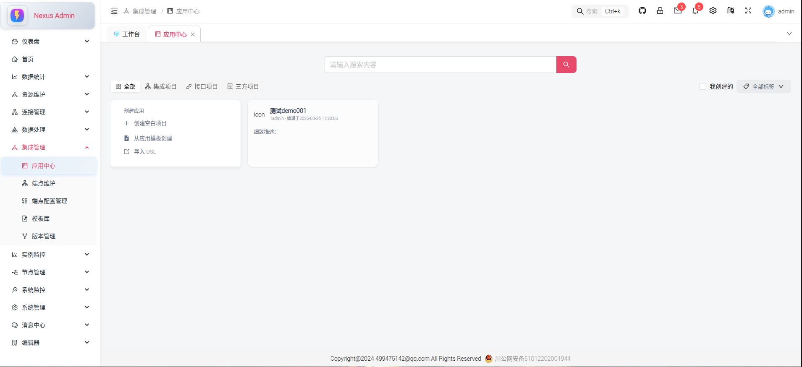

# Nexus 集成信息管理平台

<div align="center">
  
  <p><em>Nexus 集成信息管理平台 - 工作台界面</em></p>
</div>

## 📋 项目简介

Nexus 是一个现代化的集成信息管理平台，专为多协议、多系统耦合而设计。通过配置服务和发布机制，实现不同厂商系统之间的最简化对接，为企业数字化转型提供强大的集成解决方案。

### 🎯 核心特性

- **多协议支持**: 支持 HTTP、SOAP、RPC、HL7 等多种通信协议
- **可视化工作流**: 基于 Apache Camel 的图形化流程设计
- **实时监控**: 完整的系统监控和日志追踪
- **安全可靠**: 数据加密传输，权限精细化管理
- **扩展性强**: 支持自定义组件和插件扩展

## 🏗️ 技术架构

### 前端技术栈

- **React 19.1.9** - 现代化的用户界面框架
- **Ant Design 5.x** - 企业级 UI 组件库
- **Rsbuild** - 快速的前端构建工具
- **TypeScript** - 类型安全的 JavaScript 超集
- **Zustand** - 轻量级状态管理
- **React Router 7.x** - 客户端路由管理
- **TanStack Query** - 强大的数据获取和缓存
- **ECharts** - 数据可视化图表库
- **Sass** - CSS 预处理器

### 后端技术栈

- **Spring Boot 3.4.5** - 企业级 Java 应用框架
- **JDK 21** - 最新的 Java 开发工具包
- **MyBatis-Flex** - 灵活的 ORM 框架
- **Apache Camel** - 企业集成模式框架

### 开发工具

- **Bun** - 快速的 JavaScript 运行时和包管理器
- **Biome** - 快速的代码格式化和检查工具
- **Tailwind CSS** - 实用优先的 CSS 框架

## 🖼️ 系统界面展示

### 登录界面
<div align="center">
  
  <p><em>安全登录界面，支持多种认证方式</em></p>
</div>

### 工作台
<div align="center">
  
  <p><em>集成工作台，提供流程监控和快速操作</em></p>
</div>

### 应用中心
<div align="center">
  
  <p><em>应用管理中心，支持应用的创建、配置和发布</em></p>
</div>

### 快捷搜索
<div align="center">
  
  <p><em>智能搜索功能，快速定位系统资源</em></p>
</div>

### 模板中心
<div align="center">
  
  <p><em>丰富的集成模板库，加速开发流程</em></p>
</div>

### 用户管理
<div align="center">
  
  <p><em>完整的用户权限管理体系</em></p>
</div>

### 角色维护
<div align="center">
  
  <p><em>灵活的角色权限配置</em></p>
</div>

### 菜单维护
<div align="center">
  
  <p><em>动态菜单配置和管理</em></p>
</div>

### 系统参数
<div align="center">
  
  <p><em>系统参数配置和监控</em></p>
</div>

## 🚀 Apache Camel 集成

### 集成架构

Nexus 平台深度集成 Apache Camel，作为核心的数据交互引擎：


### 支持的 Camel 组件

- **HTTP/HTTPS**: RESTful API 和 Web 服务调用
- **SOAP**: Web 服务集成
- **File**: 文件传输和处理
- **FTP/SFTP**: 文件传输协议
- **Database**: 数据库连接和操作
- **JMS/AMQP**: 消息队列集成
- **Timer**: 定时任务调度
- **Mail**: 邮件服务集成
- **自定义组件**: 支持业务特定的集成需求

### 路由配置示例

```java
@Component
public class IntegrationRoute extends RouteBuilder {
    
    @Override
    public void configure() throws Exception {
        // HTTP 到数据库的集成路由
        from("direct:http-to-db")
            .log("接收到 HTTP 请求: ${body}")
            .transform().jsonpath("$.data")
            .to("sql:INSERT INTO integration_log (data, timestamp) VALUES (:#data, :#timestamp)")
            .setBody(constant("数据已成功处理"));
            
        // 定时数据同步
        from("timer:sync?period=30000")
            .to("sql:SELECT * FROM source_table WHERE updated_at > :#lastSync")
            .split(body())
            .to("http4://target-system/api/sync")
            .log("同步完成: ${body}");
    }
}
```

## 📁 项目结构

```
nexus-admin/
├── src/
│   ├── components/          # 通用组件
│   │   ├── base/           # 基础组件
│   │   ├── CodeEditor/     # 代码编辑器
│   │   ├── workflow/       # 工作流组件
│   │   └── ...
│   ├── views/              # 页面视图
│   │   ├── dashboard/      # 仪表板
│   │   ├── integrated/     # 集成管理
│   │   ├── system/         # 系统管理
│   │   └── ...
│   ├── services/           # API 服务
│   ├── stores/             # 状态管理
│   ├── utils/              # 工具函数
│   └── types/              # 类型定义
├── public/                 # 静态资源
├── images/                 # 项目截图
└── docs/                   # 文档
```

## 🛠️ 开发环境设置

### 环境要求

- **Node.js**: >= 20
- **Bun**: 最新版本
- **Java**: JDK 21+
- **数据库**: MySQL 8.0+ 或 PostgreSQL 13+

### 安装依赖

```bash
# 使用 Bun 安装依赖
bun install
```

### 启动开发服务器

```bash
# 启动前端开发服务器
bun run dev
```

### 构建生产版本

```bash
# 构建生产版本
bun run build

# 预览生产构建
bun run preview
```

## 🔧 配置说明

### 环境配置

项目支持多环境配置，通过 `.env` 文件进行配置：

```bash
# 开发环境
RSBUILD_API_BASE_URL=http://localhost:9193
RSBUILD_APP_TITLE=Nexus Admin

# 生产环境
RSBUILD_API_BASE_URL=https://api.nexus.com
RSBUILD_APP_TITLE=Nexus 集成平台
```

### 代理配置

开发环境已配置 API 代理，将 `/api` 请求代理到后端服务：

```typescript
// rsbuild.config.ts
server: {
  port: 8000,
  proxy: {
    '/api': {
      target: 'http://localhost:9193',
      changeOrigin: true,
      rewrite: (path) => path.replace(/^\/api/, ''),
    },
  },
}
```

## 🔐 安全特性

### 数据加密

- **传输加密**: 所有 API 请求使用 HTTPS 加密传输
- **数据加密**: 敏感数据使用 AES 加密存储
- **密码加密**: 用户密码使用 BCrypt 加密

### 权限控制

- **RBAC 模型**: 基于角色的访问控制
- **菜单权限**: 动态菜单权限控制
- **接口权限**: API 接口级别的权限验证
- **数据权限**: 行级数据权限控制

## 📊 监控和日志

### 系统监控

- **实时监控**: 系统运行状态实时监控
- **性能指标**: CPU、内存、磁盘使用率监控
- **业务指标**: 集成流程执行统计

### 日志管理

- **操作日志**: 用户操作行为记录
- **系统日志**: 系统运行日志
- **错误日志**: 异常和错误信息记录
- **审计日志**: 数据变更审计记录

## 🚀 部署指南

### Docker 部署

```dockerfile
# Dockerfile
FROM node:22-alpine AS builder
WORKDIR /app
COPY package*.json ./
RUN bun install
COPY . .
RUN bun run build

FROM nginx:alpine
COPY --from=builder /app/dist /usr/share/nginx/html
COPY nginx.conf /etc/nginx/nginx.conf
EXPOSE 80
CMD ["nginx", "-g", "daemon off;"]
```

### 生产环境部署

```bash
# 构建生产版本
bun run build

# 部署到服务器
rsync -av dist/ user@server:/var/www/nexus-admin/
```

## 🤝 贡献指南

我们欢迎社区贡献！请遵循以下步骤：

1. Fork 本仓库
2. 创建特性分支 (`git checkout -b feature/AmazingFeature`)
3. 提交更改 (`git commit -m 'Add some AmazingFeature'`)
4. 推送到分支 (`git push origin feature/AmazingFeature`)
5. 开启 Pull Request

## 📄 许可证

本项目采用 MIT 许可证 - 查看 [LICENSE](LICENSE) 文件了解详情。

## 📞 联系我们

- **项目主页**: [GitHub Repository](https://github.com/your-org/nexus-admin)
- **问题反馈**: [Issues](https://github.com/your-org/nexus-admin/issues)
- **文档**: [Wiki](https://github.com/your-org/nexus-admin/wiki)

## 🔮 未来规划

### 短期目标 (v1.1)

- [ ] 支持更多 Apache Camel 组件
- [ ] 增强工作流可视化编辑器
- [ ] 添加更多数据源连接器
- [ ] 完善监控和告警功能

### 长期目标 (v2.0)

- [ ] 微服务架构升级
- [ ] 云原生部署支持
- [ ] AI 辅助集成配置
- [ ] 多租户支持
- [ ] 国际化支持

---

<div align="center">
  <p>⭐ 如果这个项目对您有帮助，请给我们一个 Star！</p>
  <p>Made with ❤️ by Nexus Team</p>
</div>